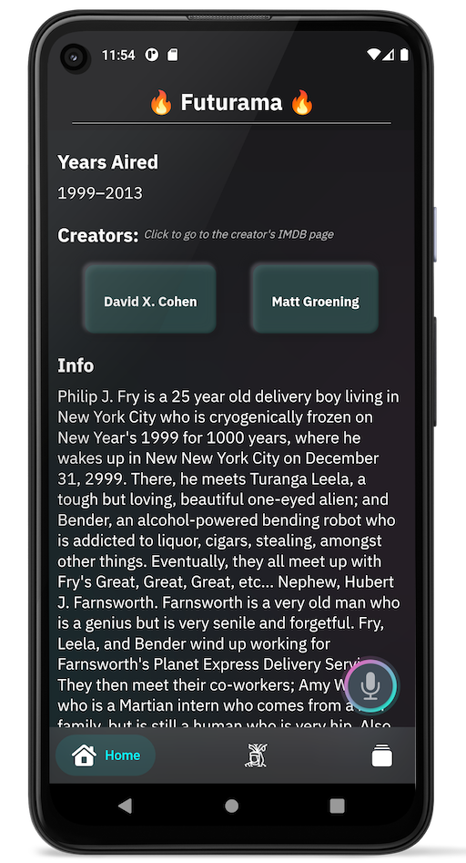
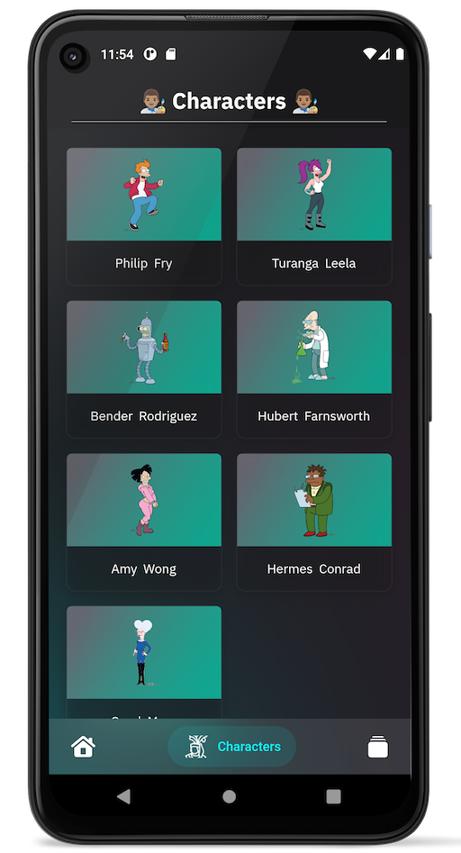
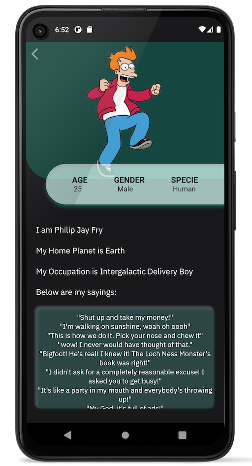
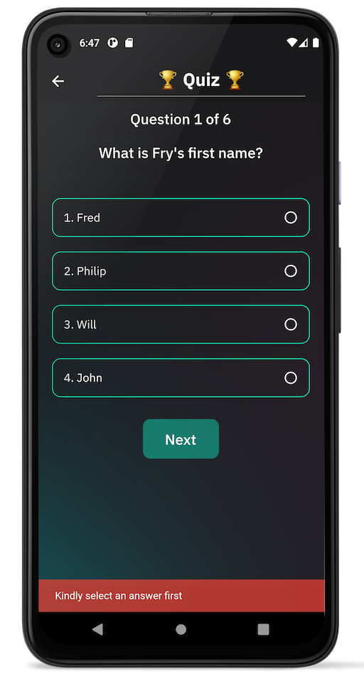
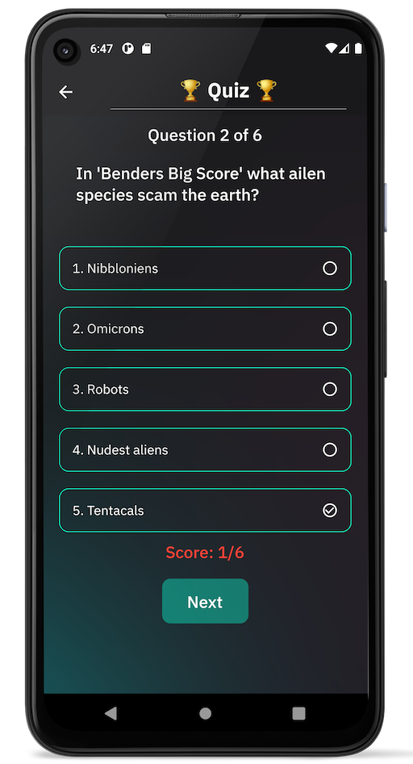

# Futurama

## Screen Shots:

 
 

<!-- ### Screen Recording
 -->

## Project Structure:

This project follows a **feature-driven directory structure.**

Below is the project's structure

<pre>
├── lib
| ├── futurama
│ │ ├── models
│ │ │ └── character_model.dart
| | | └── creator_model.dart
| | | └── post_simage_model.dart
| | | └── info_model.dart
| | | └── name_model.dart
| | | └── quiz_model.dart
| | └── providers
| | | └── character_service.dart*
| | | └── info_service.dart
| | | └── quiz_service.dart
│ │ └── views
│ │ | ├── character.dart
│ │ | └── home.dart
| | | └── quiz.dart
| | | └── splash.dart
| | └── widgets
| | | └── block_button.dart
| | | └── character_list.dart
| | | └── character_tile.dart
| | | └── creatorfile.dart
| | | └── info_page.dart
| | | └── info_tile.dart
| | | └── option.dart
| | | └── quiz_list.dart
| | | └── score_page.dart
| | | └── webview.dart
│ │ ├── constants.dart*
│ ├── main.dart
│ └── tab_bar.dart
├── screenshots
├── test
├── analysis_option.yaml
├── pubspec.lock
├── pubspec.yaml
</pre>

## Building the App:

This project was built with Flutter and dart For help getting started with Flutter, view 
[online documentation](https://flutter.dev/docs), which offers tutorials,
samples, guidance on mobile development, and a full API reference.

https://flutter.dev/

## To run the app:
- update the dependencies by running `flutter pub dev`
- use `flutter run` to run the project on your emulator
- use `flutter build apk` to build the app

## Unit test
By convention, the directory structure in the test directory mimics that in the lib directory and the Dart files have the same name, but appended with _test. This same convention is followed in this test directory.

First, I ran a simple unit test on the reset() method in the quiz service to verify that when a user click to retake the test, the score data is reset to zero, and that the page reflects the change. 

- To execute the unit test, simply run `flutter test` in the terminal.

# Project by:
## Johnson Oyeniyi