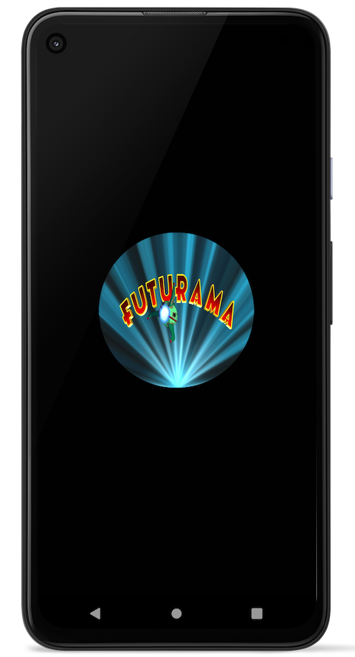

# Futurama

### Screen Shots:
 
 

### Screen Recording

## Project Structure

Follows a **feature-driven directory structure.**

Refer the project structure directly from the tutorial from 

<pre>
├── lib
| ├── futurama
│ │ ├── bloc
│ │ │ └── post_bloc.dart
| | | └── post_event.dart
| | | └── post_state.dart
| | | └── post_state.dart
| | └── models
| | | └── models.dart*
| | | └── post.dart
│ │ └── view
│ │ | ├── posts_page.dart
│ │ | └── posts_list.dart
| | | └── view.dart*
| | └── widgets
| | | └── bottom_loader.dart
| | | └── post_list_item.dart
| | | └── widgets.dart*
│ │ ├── posts.dart*
│ ├── app.dart
│ ├── simple_bloc_observer.dart
│ └── main.dart
├── pubspec.lock
├── pubspec.yaml
</pre>